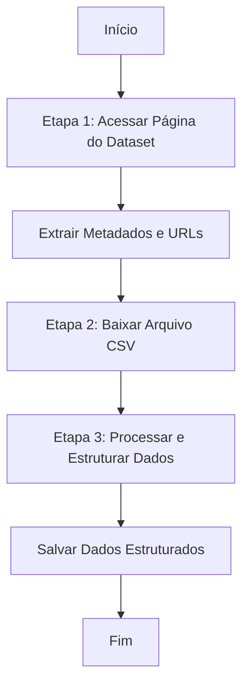

# RFC-001 - Movimentações do Tesouro Direto

---

## 1. Objetivo da Funcionalidade

Desenvolver uma funcionalidade para extrair, processar e estruturar os dados de vendas diárias do Tesouro Direto, disponibilizados pelo Tesouro Nacional no portal Tesouro Transparente. A funcionalidade deve ser capaz de:

1. Identificar e acessar o conjunto de dados (dataset) "Vendas do Tesouro Direto".
2. Extrair os metadados descritivos do dataset.
3. Baixar o arquivo CSV contendo as movimentações diárias.
4. Processar e estruturar os dados para armazenamento ou análise.

---

## 2. Arquitetura Geral

A funcionalidade seguirá um fluxo de trabalho em três etapas principais:

1. **Descoberta do Dataset:** Acessar a página principal do dataset para obter informações gerais e URLs dos recursos.
2. **Download do Arquivo CSV:** Baixar o arquivo CSV contendo as movimentações.
3. **Processamento e Estruturação:** Ler o CSV, tratar os dados e estruturá-los em um formato adequado (JSON, DataFrame, banco de dados).



---

## 3. Descrição Detalhada das Etapas

### 3.1. Etapa 1: Descoberta do Dataset e Metadados

#### 3.1.1. Acesso à Página Principal

**URL Base:**
```
https://www.tesourotransparente.gov.br/ckan/dataset/vendas-do-tesouro-direto
```

**Método:** HTTP GET

**Processamento:**
1. Realizar a requisição GET para a URL.
2. Fazer o parsing do HTML para extrair:
   - Metadados descritivos do dataset.
   - URLs dos recursos disponíveis (metadados em PDF e arquivo CSV).

#### 3.1.2. Extração de Metadados

Os metadados estão organizados na tabela "Informações Adicionais" da página:

| Campo no Portal | Campo no JSON | Descrição | Exemplo |
| :--- | :--- | :--- | :--- |
| Autor | `autor` | Autor dos dados | "COTED" |
| Versão | `versao` | Versão do dataset | "1.0" |
| Ultima Atualização | `ultimaAtualizacao` | Data da última atualização | "29 de Julho de 2026, 10:21 (UTC)" |
| Criado | `criadoEm` | Data de criação | "29 de Setembro de 2015, 19:04 (UTC)" |
| Categoria do e-VoG | `categoria` | Categoria temática | "Economia e Finanças" |
| Data de início dos dados | `dataInicio` | Data inicial da série | "Janeiro de 2002" |
| Frequência de atualização | `frequenciaAtualizacao` | Periodicidade | "Diária" |

**Exemplo de Extração (Python com BeautifulSoup):**
```python
import requests
from bs4 import BeautifulSoup

def extrair_metadados(url):
    response = requests.get(url)
    soup = BeautifulSoup(response.content, 'html.parser')
    
    metadados = {}
    # Localizar a tabela de Informações Adicionais
    tabela = soup.find('table', {'class': 'table'})  # Ajustar seletor
    if tabela:
        for row in tabela.find_all('tr'):
            cols = row.find_all('td')
            if len(cols) == 2:
                chave = cols[0].get_text(strip=True)
                valor = cols[1].get_text(strip=True)
                metadados[chave] = valor
    
    return metadados
```

#### 3.1.3. Identificação das URLs dos Recursos

Na seção "Dados e recursos", localizar:

1. **Arquivo CSV de Movimentação:**
   - Rótulo: "Vendas do Tesouro Direto"
   - Tipo: "CSV"
   - Extrair o link de download.

2. **Arquivo PDF de Metadados:**
   - Rótulo: "Metadados"
   - Tipo: "PDF"
   - Extrair o link de download.

**Estrutura das URLs:**
```
# URL base do dataset
https://www.tesourotransparente.gov.br/ckan/dataset/vendas-do-tesouro-direto

# URL do recurso CSV (exemplo)
https://www.tesourotransparente.gov.br/ckan/dataset/vendas-do-tesouro-direto/resource/e5f90e3a-8f8d-4895-9c56-4bb2f7877920

# URL de download direto do CSV
https://www.tesourotransparente.gov.br/ckan/dataset/f0468ecc-ae97-4287-89c2-6d8139fb4343/resource/e5f90e3a-8f8d-4895-9c56-4bb2f7877920/download/vendastesourodireto.csv
```

### 3.2. Etapa 2: Download do Arquivo CSV

#### 3.2.1. Obtenção da URL de Download

A URL direta para download segue o padrão:
```
https://www.tesourotransparente.gov.br/ckan/dataset/{package_id}/resource/{resource_id}/download/{nome_arquivo}
```

Onde:
- `package_id`: Identificador do dataset (ex: `f0468ecc-ae97-4287-89c2-6d8139fb4343`)
- `resource_id`: Identificador do recurso (ex: `e5f90e3a-8f8d-4895-9c56-4bb2f7877920`)
- `nome_arquivo`: Nome do arquivo (ex: `vendastesourodireto.csv`)

#### 3.2.2. Download do Arquivo

```python
import requests

def baixar_csv(url_download, caminho_destino):
    response = requests.get(url_download, stream=True)
    if response.status_code == 200:
        with open(caminho_destino, 'wb') as f:
            for chunk in response.iter_content(chunk_size=8192):
                f.write(chunk)
        return True
    return False
```

**Tratamento de Erros:**
- Verificar status HTTP (200 OK).
- Implementar timeout (ex: 60 segundos).
- Implementar retry em caso de falha (ex: 3 tentativas).
- Validar o tamanho do arquivo baixado (não vazio).

### 3.3. Etapa 3: Processamento e Estruturação dos Dados

#### 3.3.1. Estrutura do Arquivo CSV

O arquivo CSV contém o volume de vendas diário do Tesouro Direto, com as seguintes colunas esperadas:

| Coluna | Descrição | Exemplo |
| :--- | :--- | :--- |
| `data` | Data da movimentação | `2026-07-27` |
| `titulo` | Nome do título público | `Tesouro Selic 2029` |
| `venda` | Volume de vendas (em R$ ou unidades) | `1234567.89` |
| `resgate` | Volume de resgates | `987654.32` |
| `saldo` | Saldo do título | `2345678.90` |
| `vencimento` | Data de vencimento do título | `2029-03-01` |

**Observação:** A estrutura exata das colunas deve ser confirmada após o download do arquivo, pois pode haver variações ao longo do tempo.

#### 3.3.2. Leitura e Processamento do CSV

```python
import pandas as pd
import json
from datetime import datetime

def processar_csv(caminho_arquivo):
    # Ler o CSV
    df = pd.read_csv(caminho_arquivo, encoding='utf-8')
    
    # Limpeza e padronização
    # 1. Converter colunas de data
    if 'data' in df.columns:
        df['data'] = pd.to_datetime(df['data']).dt.strftime('%Y-%m-%d')
    
    # 2. Remover linhas com dados nulos (se necessário)
    df = df.dropna()
    
    # 3. Ordenar por data
    if 'data' in df.columns:
        df = df.sort_values('data')
    
    return df

def converter_para_json(df):
    """Converte o DataFrame para JSON estruturado"""
    # Metadados gerais
    metadados = {
        "dataExtracao": datetime.now().isoformat(),
        "totalRegistros": len(df),
        "periodoInicio": df['data'].min() if 'data' in df.columns else None,
        "periodoFim": df['data'].max() if 'data' in df.columns else None,
        "titulosDisponiveis": df['titulo'].unique().tolist() if 'titulo' in df.columns else []
    }
    
    # Dados agrupados
    dados_agrupados = {
        "porData": df.to_dict(orient='records'),
        "porTitulo": {
            titulo: df[df['titulo'] == titulo].to_dict(orient='records')
            for titulo in df['titulo'].unique()
        } if 'titulo' in df.columns else {}
    }
    
    return {
        "metadados": metadados,
        "dados": dados_agrupados
    }
```

#### 3.3.3. Estrutura do JSON de Saída

```json
{
  "metadados": {
    "dataset": "Vendas do Tesouro Direto",
    "fonte": "Tesouro Transparente",
    "dataExtracao": "2026-07-29T14:30:00-03:00",
    "totalRegistros": 15000,
    "periodoInicio": "2002-01-01",
    "periodoFim": "2026-07-27",
    "titulosDisponiveis": [
      "Tesouro Selic 2029",
      "Tesouro IPCA+ 2030",
      "Tesouro Prefixado 2031"
    ],
    "informacoesAdicionais": {
      "autor": "COTED",
      "versao": "1.0",
      "ultimaAtualizacao": "29 de Julho de 2026, 10:21 (UTC)",
      "categoria": "Economia e Finanças",
      "frequencia": "Diária"
    }
  },
  "dados": {
    "porData": [
      {
        "data": "2026-07-27",
        "titulo": "Tesouro Selic 2029",
        "venda": 1234567.89,
        "resgate": 987654.32,
        "saldo": 2345678.90,
        "vencimento": "2029-03-01"
      }
    ],
    "porTitulo": {
      "Tesouro Selic 2029": [
        {
          "data": "2026-07-27",
          "venda": 1234567.89,
          "resgate": 987654.32,
          "saldo": 2345678.90
        }
      ]
    }
  }
}
```

---

## 4. Implementação em Python

### 4.1. Classe Principal

```python
import requests
import pandas as pd
import json
from bs4 import BeautifulSoup
from datetime import datetime
from typing import Dict, Tuple
import os
import logging

class ExtratorTesouroDireto:
    def __init__(self):
        self.url_base = "https://www.tesourotransparente.gov.br/ckan/dataset/vendas-do-tesouro-direto"
        self.logger = self._configurar_logger()
    
    def _configurar_logger(self):
        logging.basicConfig(level=logging.INFO)
        return logging.getLogger(__name__)
    
    def extrair_metadados_e_urls(self) -> Dict:
        """Etapa 1: Extrai metadados e URLs de recursos"""
        self.logger.info("Acessando página do dataset...")
        response = requests.get(self.url_base)
        response.raise_for_status()
        
        soup = BeautifulSoup(response.content, 'html.parser')
        
        # Extrair metadados da tabela
        metadados = self._extrair_tabela_metadados(soup)
        
        # Extrair URLs dos recursos
        urls = self._extrair_urls_recursos(soup)
        
        return {
            "metadados": metadados,
            "urls": urls
        }
    
    def _extrair_tabela_metadados(self, soup):
        """Extrai metadados da tabela 'Informações Adicionais'"""
        metadados = {}
        tabela = soup.find('table')
        if tabela:
            for row in tabela.find_all('tr'):
                cols = row.find_all('td')
                if len(cols) == 2:
                    chave = cols[0].get_text(strip=True)
                    valor = cols[1].get_text(strip=True)
                    metadados[chave] = valor
        return metadados
    
    def _extrair_urls_recursos(self, soup):
        """Extrai URLs dos recursos (CSV e PDF)"""
        urls = {"csv": None, "pdf": None}
        
        # Seção "Dados e recursos"
        recursos = soup.find_all('a', href=True)
        for link in recursos:
            href = link['href']
            texto = link.get_text(strip=True).lower()
            
            if 'csv' in texto or 'vendas' in href:
                urls['csv'] = self._construir_url_completa(href)
            elif 'metadados' in texto or 'pdf' in texto:
                urls['pdf'] = self._construir_url_completa(href)
        
        return urls
    
    def _construir_url_completa(self, href):
        """Constrói URL completa a partir de href relativo"""
        if href.startswith('http'):
            return href
        if href.startswith('/'):
            return f"https://www.tesourotransparente.gov.br{href}"
        return f"{self.url_base}/{href}"
    
    def baixar_csv(self, url_csv: str, destino: str = None) -> str:
        """Etapa 2: Baixa o arquivo CSV"""
        if not destino:
            destino = f"tesouro_direto_{datetime.now().strftime('%Y%m%d')}.csv"
        
        self.logger.info(f"Baixando CSV de {url_csv}...")
        response = requests.get(url_csv, stream=True)
        response.raise_for_status()
        
        with open(destino, 'wb') as f:
            for chunk in response.iter_content(chunk_size=8192):
                f.write(chunk)
        
        self.logger.info(f"Arquivo salvo em: {destino}")
        return destino
    
    def processar_dados(self, caminho_csv: str) -> Dict:
        """Etapa 3: Processa e estrutura os dados"""
        self.logger.info("Processando dados do CSV...")
        
        # Ler CSV
        df = pd.read_csv(caminho_csv, encoding='utf-8')
        
        # Processar e estruturar
        dados_estruturados = {
            "metadados": {
                "fonte": "Tesouro Transparente",
                "dataExtracao": datetime.now().isoformat(),
                "totalRegistros": len(df)
            },
            "dados": df.to_dict(orient='records')
        }
        
        return dados_estruturados
    
    def executar(self, salvar_json: bool = True) -> Dict:
        """Executa o fluxo completo de extração"""
        try:
            # Etapa 1: Extrair metadados e URLs
            info = self.extrair_metadados_e_urls()
            
            if not info['urls']['csv']:
                raise Exception("URL do CSV não encontrada")
            
            # Etapa 2: Baixar CSV
            arquivo_csv = self.baixar_csv(info['urls']['csv'])
            
            # Etapa 3: Processar dados
            dados = self.processar_dados(arquivo_csv)
            
            # Adicionar metadados do dataset
            dados['metadados']['dataset'] = info['metadados']
            
            # Salvar JSON
            if salvar_json:
                arquivo_json = f"tesouro_direto_{datetime.now().strftime('%Y%m%d')}.json"
                with open(arquivo_json, 'w', encoding='utf-8') as f:
                    json.dump(dados, f, indent=2, ensure_ascii=False)
                self.logger.info(f"Dados salvos em: {arquivo_json}")
            
            return dados
            
        except Exception as e:
            self.logger.error(f"Erro na execução: {e}")
            raise
```

### 4.2. Exemplo de Uso

```python
# Instanciar e executar
extrator = ExtratorTesouroDireto()
dados = extrator.executar()

# Acessar os dados
print(f"Total de registros: {dados['metadados']['totalRegistros']}")
print(f"Primeiros registros: {dados['dados'][:5]}")
```

---

## 5. Tratamento de Erros e Robustez

### 5.1. Validações

1. **Resposta HTTP:** Verificar status codes e cabeçalhos.
2. **Conteúdo do CSV:** Validar se o arquivo não está vazio.
3. **Estrutura dos Dados:** Verificar colunas esperadas.
4. **Tipos de Dados:** Converter datas e números corretamente.

### 5.2. Estratégias de Fallback

1. **Parsing de HTML:** Utilizar múltiplos seletores CSS/XPath.
2. **CSV:** Se falhar, tentar outras codificações (ex: `latin-1`).
3. **Requisições:** Implementar retry com backoff exponencial.

### 5.3. Logging e Monitoramento

```python
import logging

logging.basicConfig(
    level=logging.INFO,
    format='%(asctime)s - %(name)s - %(levelname)s - %(message)s',
    handlers=[
        logging.FileHandler('extracao_tesouro.log'),
        logging.StreamHandler()
    ]
)
```

---

## 6. Considerações Finais

### 6.1. Pontos de Atenção

1. **Estrutura do CKAN:** O portal Tesouro Transparente utiliza CKAN, plataforma padrão para datasets governamentais.
2. **Atualização Diária:** O dataset é atualizado diariamente, com defasagem de dois dias úteis. Ele é cumulativo, isto é, os dados sempre refletem toda a base desde 2002. Dessa forma, não é necessário guardar o histórico de arquivos CSV baixados anteriormente, mas sim guardar apenas a ultima versão atualizada do arquivo CSV.
3. **Tamanho do Arquivo:** O CSV tem aproximadamente 7 MB, com dados desde 2002.
4. **Licenciamento:** Dados sob Licença Aberta (ODbL), permitindo uso e redistribuição.

### 6.2. Melhorias Futuras

1. **Automatização:** Agendar execuções diárias para manter dados atualizados.
2. **Armazenamento:** Integrar com banco de dados (PostgreSQL, SQLite).
3. **Análises:** Implementar funções de análise (tendências, sazonalidade).
4. **Visualização:** Gerar relatórios e gráficos automaticamente.
5. **Comparações:** Cruzar dados com outros indicadores econômicos.

### 6.3. Dependências de Instalação (sugestão)

```bash
pip install requests pandas beautifulsoup4 lxml
# Para análise avançada:
pip install numpy matplotlib seaborn
```

## 6.4. Outras Considerações

- **Simplicidade:** Preferir bibliotecas nativas a dependencias externas. Usar dependencias externas somente quando estritamente necessário.
- **Segurança:** Só usar dependencias externas que sejam amplamente testadas e aceitas no mercado. Nada de dependencias pouco usadas ou desconhecidas.
- **Logging:** Registrar todas as etapas, especialmente falhas de parsing ou dados não encontrados.
- **Evolução:** Esta abordagem pode ser estendida para outros tipos de relatórios não estruturados que utilizem arquivos CSV.

